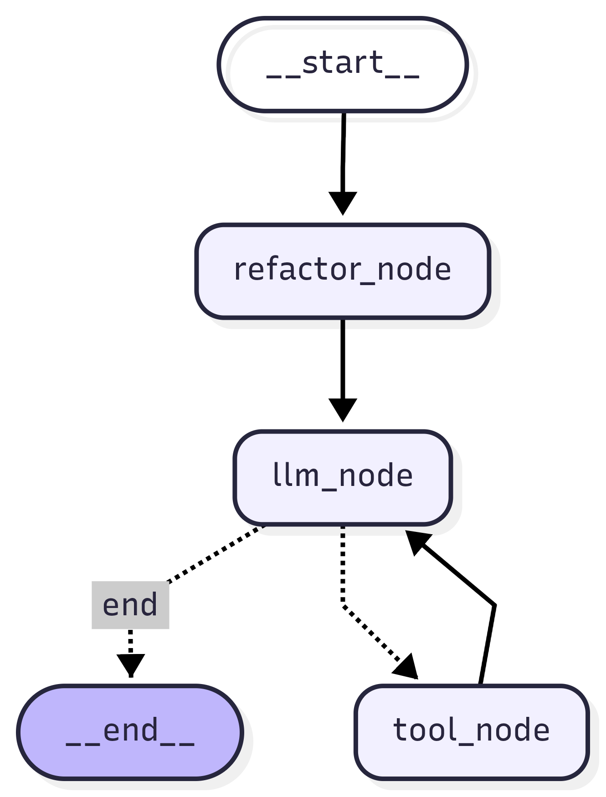

# PDP-Agent: Autonomous Linux Automation Agent

A sophisticated AI-powered Linux automation agent with intelligent self-correction, user approval workflows, and interactive command execution. Built with LangChain, LangGraph, and advanced LLM reasoning for complex task automation.

## Overview

PDP-Agent is an interactive autonomous agent designed to fulfill complex Linux automation tasks through natural language instructions. The agent employs intelligent decision-making, user approval checkpoints for shell commands, and automatic error detection with self-correction capabilities to ensure reliable task execution.

## Key Features

🤖 **Intelligent Task Execution**

- Processes natural language requests and translates them into shell commands
- Automatically discovers and validates file paths using intelligent search mechanisms
- Executes commands with full context awareness and support for multiple commands

✅ **User Approval & Safety**

- Interactive approval prompts before executing shell commands
- "Allow All" option to streamline repeated command execution
- Graceful rejection of skipped commands
- No automatic command execution without explicit user consent

🔄 **Self-Correction & Error Handling**

- Analyzes command output for errors and unexpected results
- Diagnoses failure root causes (permissions, missing files, syntax errors, environment issues)
- Automatically retries with corrected commands after diagnosis
- Maximum 3 retry attempts per task with detailed error reporting

🔍 **Web Search Integration**

- Built-in DuckDuckGo search capability for information gathering
- Helps supplement shell command execution with real-time data

🛡️ **Safety & Reliability**

- Uses absolute paths exclusively to prevent ambiguity
- Handles timeout errors, permission issues, and missing dependencies gracefully
- Provides clean, structured output summaries without verbose logs

## Technology Stack

- **LangChain**: LLM orchestration and prompt management
- **LangGraph**: Agent workflow and state management with interrupts
- **ChatGroq**: LLM API integration (openai/gpt-oss-120b)
- **Python 3.12+**: Core runtime

## Prerequisites

- Python 3.12 or higher
- `uv` package manager (or pip)
- Valid Groq API key
- Linux/Unix-based system (or WSL on Windows)

## Installation

1. **Clone the repository**

```bash
git clone <repository-url>
cd PDP-Agent
```

2. **Install dependencies with uv**

```bash
uv sync
```

Or with pip:

```bash
pip install -e .
```

3. **Configure environment variables**

```bash
# Create .env file in project root with your Groq API key
export GROQ_API_KEY=your_groq_api_key
```

## Configuration

### Environment Variables

Set your Groq API key:

```bash
export GROQ_API_KEY=your_groq_api_key
```

### LLM Configuration

The agent uses ChatGroq with gpt-oss-120b model. Modify settings in `main.py`:

```python
llm = ChatGroq(
    model="openai/gpt-oss-120b",  # Model selection
    temperature=0,                 # Response determinism
    max_retries=3                  # Retry attempts
)
```

## Usage

### Basic Execution

```bash
python main.py
```

### Interactive Mode

The agent operates in an interactive workflow:

1. **Input Prompt**: `Enter you input | Enter no to exit:`
2. **Request Refactoring**: User input is reformatted into a concise execution prompt
3. **Agent Processing**: Displays `⏳ Agent is processing your request...`
4. **Command Approval**: Before executing any shell commands, you'll be asked:
   - `"Are you okay to run, type 'allow all' to allow all the commands or type 'yes' to allow single command (y/n) :"`
   - Options: `yes` or `y` (single command), `allow all` (all subsequent commands)
5. **Execution**: Executes approved shell commands with output capture
6. **Response**: Returns results and final status
7. **Loop**: Ready for next command or enter "no" to exit

### Example Commands

```
# File operations
"Create a file named test.txt in /home/pdp28/PDP-Agent"

# Directory management
"List all Python files in the current directory"

# System information
"Show disk usage for the home directory"

# Information gathering
"Search for information about LLM optimization techniques"
```

## Project Structure

```
PDP-Agent/
├── main.py                 # Main agent implementation
├── .env.example           # Environment template
├── .venv/                 # Virtual environment (auto-created)
├── requirements.txt       # Python dependencies
├── README.md             # This file
└── 1.Graph.ipynb         # Jupyter notebook for visualization
```

## Core Components

### `Tool_state` (TypedDict)

Manages agent state with:

- `messages`: Full conversation history for context
- `allow_all`: Boolean flag for skipping approval prompts

### `shell_tool` (Function)

Executes shell commands with:

- Support for multiple commands in a single call
- Error handling and timeout management (30-second default)
- Output capture (stdout + stderr combined)
- Automatic input handling (auto-confirms with "y\n")
- Working directory: `/home/pdp28/`

### `duckduckgo_search` (Tool)

Provides web search capabilities using DuckDuckGo for information gathering tasks.

### `refactor_node` (Function)

- Reformats user input into a concise execution prompt
- Improves clarity for the LLM's understanding of the request

### `llm_node` (Function)

- Processes message history (keeps first message + last 10 for token optimization)
- Invokes LLM with system prompt and user messages
- Binds tools: `shell_tool` and `duckduckgo_search`
- Displays processing status

### `tool_node` (Function)

- Routes tool calls to appropriate handlers
- Implements user approval workflow for shell commands
- Respects "allow all" flag for batched command execution
- Appends tool responses to message history

### `if_tool_call` (Router)

- Determines if the LLM has called any tools
- Routes to `tool_node` if tools called, otherwise ends workflow

### `graph` (StateGraph)

Orchestrates the workflow with LangGraph:

```
START → refactor_node → llm_node → if_tool_call → (tool_node → llm_node)* → END
```

Includes interrupt points for user approval at tool execution phase.

## Execution Flow

```
User Request
    ↓
Request Refactoring (reformat input)
    ↓
LLM Analysis & Planning
    ↓
Tool Selection (shell/search)
    ↓
User Approval Prompt (shell commands only)
    ↓
Command Execution
    ↓
Output Analysis
    ↓
Error Detection? → Self-Correct Loop → Re-execute
    ↓ (No errors)
Final Response
```

## User Approval System

The agent includes built-in approval checkpoints to ensure safe execution:

**Shell Command Approval**

- Every shell command requires user approval before execution
- Prompt shows the command being executed
- Response options:
  - `yes` or `y`: Execute the single command
  - `allow all` or `allow`: Execute this and all future commands without prompts
  - Other responses: Skip the command

**Web Search**

- DuckDuckGo search runs without approval (no side effects)
- Results used to enhance agent decision-making

## Error Handling

The agent intelligently handles:

| Error Type           | Strategy                                                           |
| -------------------- | ------------------------------------------------------------------ |
| Timeout Errors       | Returns timeout error message (30-second limit)                    |
| Permission Errors    | Captures stderr, suggests sudo or permission fixes                 |
| Missing Dependencies | Suggests installation or alternatives                              |
| Environment Errors   | Verifies PATH, environment variables                               |
| Command Failures     | Auto-diagnoses and retries with corrected command (max 3 attempts) |

## Message History Management

- Keeps the initial user message for context
- Retains the last 10 messages to avoid token limit overflow
- Automatically trims conversation when exceeding 11 messages
- Maintains message ordering for proper LLM reasoning

## Performance Considerations

- **Timeout**: 30 seconds per command (configurable in `shell_tool`)
- **Working Directory**: `/home/pdp28/` (configurable in `shell_tool`)
- **Max Retries**: 3 attempts per task (configurable in LLM initialization)
- **Token Optimization**: Automatic message history pruning (keeps first + last 10 messages)
- **Checkpoint**: In-memory checkpoint saver for session state (thread-based)

## Troubleshooting

### Agent Not Responding

- Check OpenRouter API key validity in `.env`
- Verify internet connectivity
- Check API rate limits

### Command Execution Failures

- Review error messages for root cause
- Ensure required tools/packages are installed
- Check file permissions and path accessibility

### Timeout Issues

- Increase timeout value in `shell_tool` function
- Break complex commands into smaller tasks
- Check system resource availability

## Contributing

Contributions are welcome! Please consider:

1. Maintaining code quality and readability
2. Adding comprehensive error handling
3. Updating documentation for new features
4. Testing with various command scenarios
5. Following the existing code style

## Support

For issues, questions, or suggestions:

- Review the troubleshooting section
- Check existing error messages and logs
- Verify environment configuration

## Future Enhancements

- [ ] Persistent checkpoint storage (database instead of in-memory)
- [ ] Enhanced graph visualization for workflow monitoring
- [ ] Batch command mode for high-trust scenarios
- [ ] Command history with replay capability
- [ ] Advanced logging and audit trails
- [ ] Web UI for interactive command execution
- [ ] Integration with CI/CD pipelines
- [ ] Custom tool registration for domain-specific tasks

---

**Version**: 2.0.0  
**Last Updated**: April 2026  
**Status**: Active Development

## Recent Updates (v2.0.0)

- Refactored tool state management to support user approval workflows
- Added interactive interrupt/approval prompts for shell commands
- Enhanced request processing with input refactoring node
- Integrated web search capabilities via DuckDuckGo
- Improved error handling with better diagnostics
- Switched to ChatGroq for improved performance
